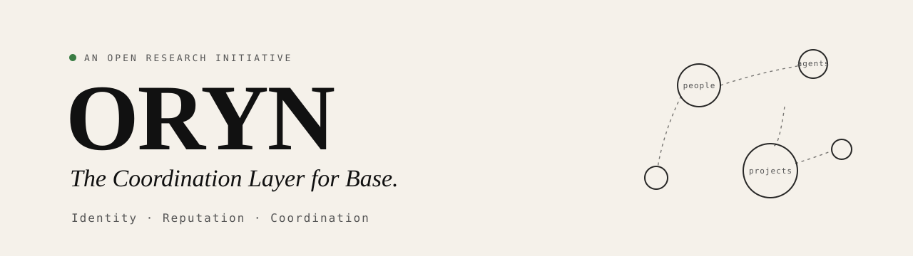
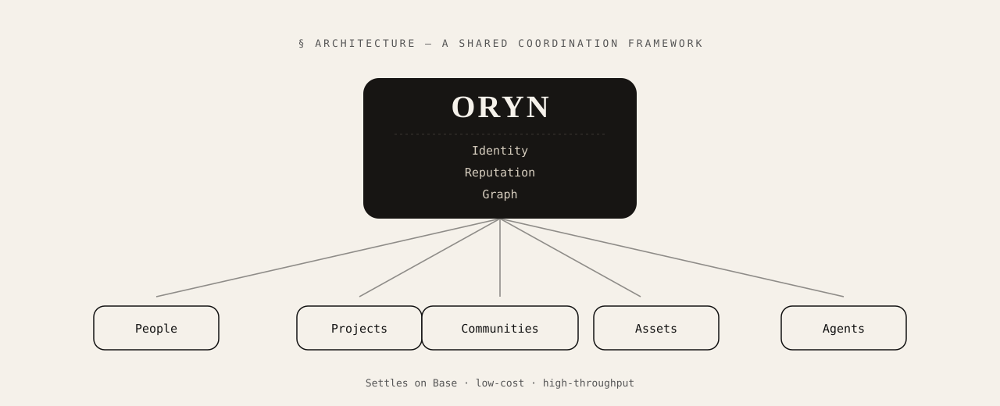

<div align="center">



<h1>ORYN</h1>

**The Coordination Layer for Base.**

_Identity · Reputation · Coordination_

<p>
  
  
  
</p>

<p>
  
  
  
  
  
</p>

<a href="https://oryn.lat"><b>oryn.lat</b></a> ·
<a href="docs.html">Docs</a> ·
<a href="manifesto.html">Manifesto</a> ·
<a href="github.html">Repositories</a>

</div>

---

> The internet connected **information**.
> Blockchains connected **assets**.
> The next layer connects **participants**.
> ORYN is exploring what comes next.

## Overview

Today every entity on a blockchain exists in isolation — users, projects, NFTs, AI
agents, communities, DAOs all operate independently. There is no shared layer to
**establish identity**, **measure reputation**, or **connect entities** to one another.

**ORYN** is researching that infrastructure: a shared coordination layer for
[Base](https://base.org), so any application can read a participant's portable
identity, query their reputation in context, and walk the relationship graph —
instead of rebuilding the same social plumbing over and over.

## Architecture

<div align="center">
  
</div>

ORYN provides a shared coordination framework for ecosystem participants — **people,
projects, communities, assets, and agents** — anchored by three composable primitives.

## Core primitives

| # | Primitive | What it does | Phase |
|---|-----------|--------------|-------|
| i | **Identity** | Persistent participation across applications. | 1 |
| ii | **Reputation** | Trust built through contribution. | 2 |
| iii | **Graph** | Relationships between ecosystem participants. | 3 |

```ts
// The shape of an ORYN read (conceptual)
const participant = await oryn.identity.resolve("base:0xabc…");

participant.reputation.in("governance");          // contextual trust score
participant.graph.neighbors({ edge: "contributor" });
participant.graph.path(to: "base:0xdef…");        // trust path between two participants
```

## The ORYN model

Identity is the anchor. Reputation attaches to it. The graph connects it all.

```ts
// 1 — Identity: a portable, participant-owned presence
type Identity = {
  id:      `base:0x${string}`;
  kind:    "person" | "project" | "community" | "asset" | "agent";
  profile: { name: string; avatar?: string; links: string[]; proofs: Proof[] };
  since:   number;
};

// 2 — Reputation: earned, contextual, decaying — never purchased
function reputation(p: Identity, ctx: string): Score {
  return f(
    contributions(p, ctx),   // what they did
    vouches(p, ctx),         // who trusts them
    decay(time),             // tracks present standing
  );
}

// 3 — Graph: typed, directional relationships
//   person   --contributes_to--> project
//   project  --belongs_to------> community
//   person   --vouches_for-----> person
//   agent    --operates--------> asset
```

```bash
# Discovery becomes a first-class capability over a shared graph
oryn graph neighbors  base:0xabc…  --edge contributor
oryn graph path       base:0xabc…  base:0xdef…
oryn graph clusters   --around base:0xabc…
oryn graph bridges    # participants connecting separate scenes
```

## Project structure

```text
oryn/
├── index.html            # Home — one-page overview with scroll animations
├── docs.html             # Documentation
├── manifesto.html        # Manifesto (long-form essay)
├── identity.html         # Primitive i  — Identity
├── reputation.html       # Primitive ii — Reputation
├── graph.html            # Primitive iii — Graph
├── research-001.html     # Research #001 — Identity Systems
├── research-002.html     # Research #002 — Reputation Networks
├── research-003.html     # Research #003 — Coordination Graphs
├── github.html           # Repositories overview
├── styles.css            # Design system + responsive + animations
├── script.js             # Scroll reveal + "handwrite" text animation
└── assets/
    ├── banner.svg
    └── architecture.svg
```

## Quick start

No build step, no dependencies — it is a static site.

```bash
# 1 — clone
git clone https://github.com/Orynlat/Oryn.git
cd Oryn

# 2 — serve locally (pick one)
python -m http.server 8080          # Python 3
npx serve .                         # Node
php -S localhost:8080               # PHP

# 3 — open
#   http://localhost:8080
```

## Deploy (GitHub Pages)

```bash
# Settings → Pages → Source: "Deploy from a branch" → main / root
# Live at: https://orynlat.github.io/Oryn/
```

## Design system

Warm, research-paper aesthetic — deliberately not traditional crypto blue.

```css
:root {
  --bg:        #F5F1EA;  /* paper / cream      */
  --ink:       #111111;  /* primary text       */
  --muted:     #555555;  /* secondary text     */
  --accent:    #EAE5DD;  /* cards / highlights  */
  --paper-dark:#171513;  /* dark sections      */

  --serif: "Fraunces", Georgia, serif;       /* display */
  --sans:  "Space Grotesk", system-ui;       /* body    */
  --mono:  "JetBrains Mono", monospace;       /* code    */
}
```

## Roadmap

| Phase | Theme | Deliverables |
|-------|-------|--------------|
| **0** | Genesis | Brand · Research · Documentation |
| **1** | Identity | Registry · Profiles |
| **2** | Reputation | Trust · Contribution |
| **3** | Graph | Relationships · Discovery |
| **4** | Protocol | SDK · Developer APIs |

## Repositories

| Repo | Purpose |
|------|---------|
| `oryn-docs` | Documentation, research notes, specifications |
| `oryn-registry` | Onchain identity creation, profiles, resolution |
| `oryn-graph` | The shared coordination graph and discovery queries |
| `oryn-sdk` | Client libraries and developer APIs for integrators |

## Contributing

ORYN is built in the open, and reputation here is earned the same way it is
everywhere in ORYN — through contribution.

```bash
git checkout -b feat/your-idea
git commit -m "feat: describe your change"
git push origin feat/your-idea
# then open a pull request
```

## License

Released under the **MIT License**.

---

<div align="center">

**ORYN** · The Coordination Layer for Base.

Open infrastructure. Open research. Open participation.

<a href="https://oryn.lat">oryn.lat</a>

</div>
